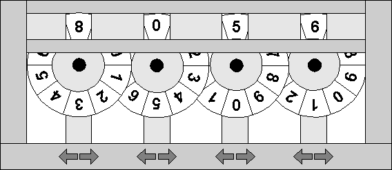

# 10067 - Playing with Wheels

In this problem we will be considering a game played with four wheels. Digits ranging from 0 to 9
are printed consecutively (clockwise) on the periphery of each wheel. The topmost digits of the wheels
form a four-digit integer. For example, in the following figure the wheels form the integer 8056. Each
wheel has two buttons associated with it. Pressing the button marked with a *left arrow* rotates the
wheel one digit in the clockwise direction and pressing the one marked with the *right arrow* rotates it
by one digit in the opposite direction.



The game starts with an initial configuration of the wheels. Say, in the initial configuration the
topmost digits form the integer *S<sub>1</sub>S<sub>2</sub>S<sub>3</sub>S<sub>4</sub>*. 
You will be given some (say, *n*) forbidden configurations *F<sub>i1</sub> F<sub>i2</sub> F<sub>i3</sub> F<sub>i4</sub>*
(1 ≤ *i* ≤ *n*) and a target configuration *T<sub>1</sub>T<sub>2</sub>T<sub>3</sub>T<sub>4</sub>*. 
Your job will be to write a program that can calculate the minimum number of button presses required to 
transform the initial configuration to the target configuration by never passing through a forbidden one.


## Input
The first line of the input contains an integer N giving the number of test cases to follow.
The first line of each test case contains the initial configuration of the wheels specified by 4 digits.
Two consecutive digits are separated by a space. The next line contains the target configuration. The
third line contains an integer n giving the number of forbidden configurations. Each of the following n
lines contains a forbidden configuration. There is a blank line between two consecutive input sets.


## Output
For each test case in the input print a line containing the minimum number of button presses required.
If the target configuration is not reachable then print ‘-1’.


## Sample Input

```bash
2
8 0 5 6
6 5 0 8
5
8 0 5 7
8 0 4 7
5 5 0 8
7 5 0 8
6 4 0 8
0 0 0 0
5 3 1 7
8
0 0 0 1
0 0 0 9
0 0 1 0
0 0 9 0
0 1 0 0
0 9 0 0
1 0 0 0
9 0 0 0
```

## Sample Output

```bash
14
-1
```

[\[pdf\]](https://uva.onlinejudge.org/external/100/10067.pdf)
