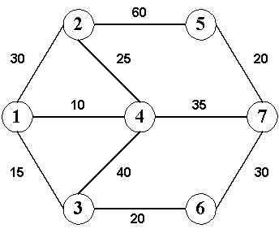

# 10099 - The Tourist Guide

Mr. G. works as a tourist guide. His current assignment is to take some tourists from one city to
another. Some two-way roads connect the cities. For each pair of neighboring cities there is a bus
service that runs only between those two cities and uses the road that directly connects them. Each
bus service has a limit on the maximum number of passengers it can carry. Mr. G. has a map showing
the cities and the roads connecting them. He also has the information regarding each bus service. He
understands that it may not always be possible for him to take all the tourists to the destination city
in a single trip. For example, consider the following road map of 7 cities. The edges connecting the
cities represent the roads and the number written on each edge indicates the passenger limit of the bus
service that runs on that road.



Now, if he wants to take 99 tourists from city 1 to city 7, he will require at least 5 trips and the
route he should take is : 1 - 2 - 4 - 7.
But, Mr. G. finds it difficult to find the best route all by himself so that he may be able to take all
the tourists to the destination city in minimum number of trips. So, he seeks your help.


## Input

The input will contain one or more test cases. The first line of each test case will contain two integers:
*N (N ≤ 100)* and *R* representing respectively the number of cities and the number of road segments.
Then *R* lines will follow each containing three integers: *C<sub>1</sub>, C<sub>2</sub>* and 
*P. C<sub>1</sub>* and *C<sub>2</sub>* are the city numbers
and *P (P > 1)* is the limit on the maximum number of passengers to be carried by the bus service
between the two cities. City numbers are positive integers ranging from 1 to *N*. The (*R* + 1)-th line
will contain three integers: *S, D* and *T* representing respectively the starting city, the destination city
and the number of tourists to be guided.

The input will end with two zeroes for *N* and *R*.


## Output

For each test case in the input first output the scenario number. Then output the minimum number
of trips required for this case on a separate line. Print a blank line after the output of each test case.


##Sample Input

```bash
7 10
1 2 30
1 3 15
1 4 10
2 4 25
2 5 60
3 4 40
3 6 20
4 7 35
5 7 20
6 7 30
1 7 99
0 0
```

## Sample Output

```bash
Scenario #1
Minimum Number of Trips = 5
```

[\[pdf\]](https://uva.onlinejudge.org/external/100/10099.pdf)
